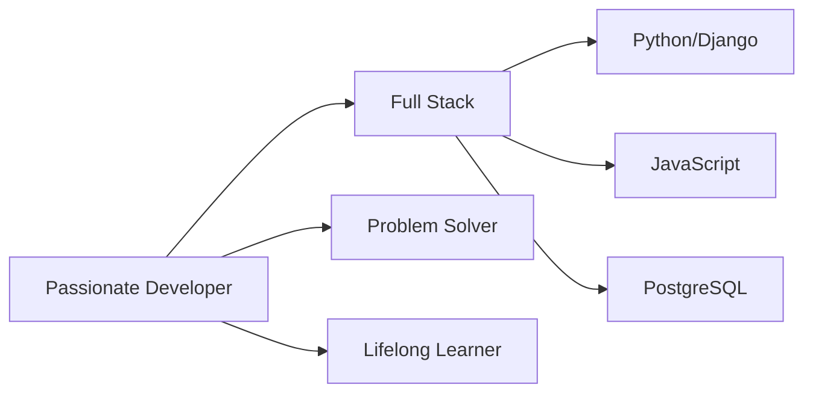

  

  
  
  
  

---

## 🚀 About Me

I am an aspiring **Python Full Stack Developer** with a strong passion for building practical web applications and continuously improving my programming skills. I believe in learning by doing and enjoy turning ideas into functional, user-friendly applications.

---

   

  

  

